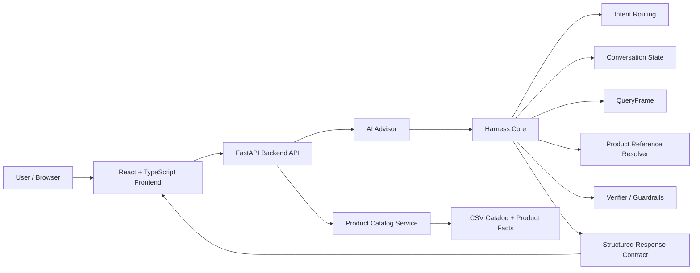

# AURA AI Sales Advisor

AURA AI Sales Advisor is an AI-assisted e-commerce system for technology products. The project combines a product catalog storefront with an AI Advisor that can understand Vietnamese shopping queries, retrieve grounded product data, keep conversation context, compare products, and return structured responses linked to product cards.

The main technical point of the project is controlled AI behavior: the advisor does not answer freely from a language model, but is coordinated by a harness layer with intent routing, query frames, catalog retrieval, product reference resolution, verification, response contracts, and conversation state.

## Main Features

- Browse a technology product catalog.
- Search and filter products by brand, price, category, CPU, GPU, RAM, SSD, and use case.
- Ask the AI Advisor product-selection questions in Vietnamese.
- Keep context for follow-up queries such as "mẫu đó", "2 mẫu này", "vừa hỏi", and "vừa tư vấn".
- Compare products using grounded catalog data.
- Synchronize AI answers with related product cards.
- Verify answer/product consistency before returning the response.

## Architecture



## Project Structure

```text
SourceCode/
├── backend/
│   ├── api/              # FastAPI entrypoint and API schemas/routes
│   ├── services/         # Catalog, advisor, conversation, ranking, observability
│   ├── harness/          # Harness runtime, context, pre/postflight, trace, governance
│   ├── agent/            # Intent router, query frame, response composer, verifier
│   ├── retrieval/        # Retrieval-related modules
│   ├── verification/     # Verification workflow and utilities
│   └── workflows/        # Research workflow package
│
├── frontend/
│   ├── src/
│   │   ├── components/   # Storefront, copilot, and UI components
│   │   ├── stores/       # Zustand client state
│   │   ├── types/        # TypeScript contracts
│   │   └── data/         # Frontend data helpers
│   └── package.json
│
├── data/                 # Product catalog and supporting product data
├── tests/                # Unit, integration, API contract, harness, verifier tests
├── scripts/              # Data ingestion and catalog validation scripts
├── requirements.txt      # Python dependencies
├── pytest.ini            # Pytest configuration
├── conftest.py           # Shared pytest setup
├── .env.example          # Local environment template
└── README.md
```

The canonical backend entrypoint is:

```bash
python -m uvicorn backend.api.main:app --host 127.0.0.1 --port 8000 --reload --reload-dir backend
```

## Requirements

- Python 3.10 or newer
- Node.js 18 or newer
- npm

The default local mode uses deterministic catalog logic and does not require external LLM keys.

## Environment Setup

Create a local `.env` file:

```bash
cp .env.example .env
```

On Windows PowerShell:

```powershell
Copy-Item .env.example .env
```

Important local settings:

```env
PRODUCT_CATALOG_PATH=./data/product_catalog_real.csv
ENABLE_EXTERNAL_AI_WORKFLOW=false
ENABLE_LLM_DECISION_PHRASING=false
AGENT_SHADOW_MODE=false
EXPOSE_DECISION_TRACE=false
```

Do not commit `.env` or real API keys.

## Run The Project

### 1. Start Backend

```bash
pip install -r requirements.txt
python -m uvicorn backend.api.main:app --host 127.0.0.1 --port 8000 --reload --reload-dir backend
```

Backend URL:

```text
http://127.0.0.1:8000
```

### 2. Start Frontend

```bash
cd frontend
npm install
npm run dev
```

Frontend URL:

```text
http://localhost:5173
```

## API Checks

Health check:

```bash
curl http://127.0.0.1:8000/health
```

Product API:

```bash
curl "http://127.0.0.1:8000/api/products?limit=2"
```

Chat API:

```bash
curl -X POST http://127.0.0.1:8000/api/chat \
  -H "Content-Type: application/json" \
  -d "{\"message\":\"Cho tôi laptop Dell dưới 20 triệu\",\"history\":[],\"conversation_state\":null}"
```

## Basic Tests

Run focused regression tests:

```bash
python -m pytest tests/test_intent_router_v2.py tests/test_api_contract_runtime.py -q
```

Run a broader harness/product-reference check:

```bash
python -m pytest tests/test_harness_runtime.py tests/test_product_reference_resolution.py -q
```

Build frontend:

```bash
cd frontend
npm run build
```

## Notes

- `requirements.txt` is required to install backend dependencies.
- `pytest.ini` and `conftest.py` are test configuration files.
- `.env.example` is only a template; the real `.env` file must stay local.
- Runtime files such as database files, logs, caches, build outputs, and local helper scripts are ignored by Git.
