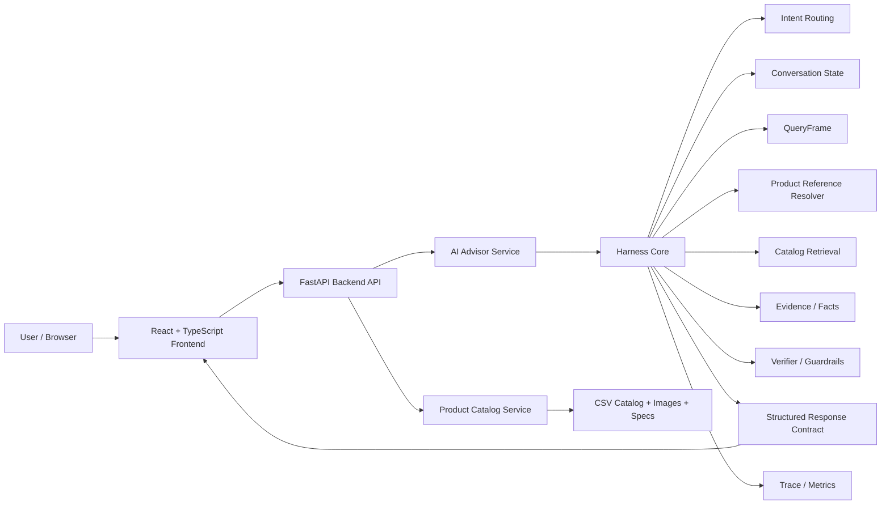
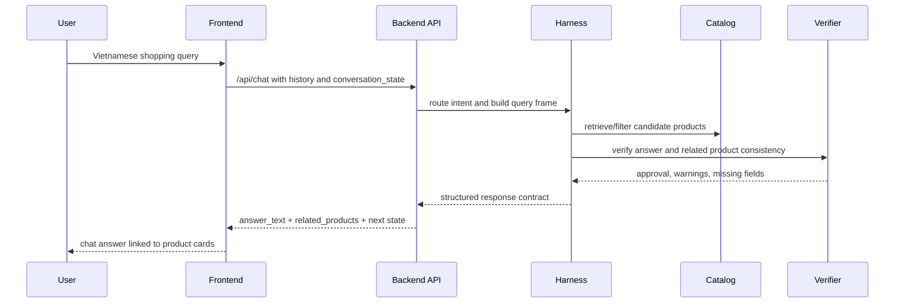

# AURA AI Sales Advisor

AURA AI Sales Advisor is an AI-assisted e-commerce system for technology products. The project combines a product catalog storefront with an AI Advisor that can understand Vietnamese shopping queries, retrieve grounded product data, keep conversation context, compare products, and return structured responses linked to product cards.

The central technical idea is not to let the language model answer freely. The AI Advisor is controlled by a harness layer that coordinates intent routing, query frames, catalog retrieval, product reference resolution, evidence tracking, verification, response contracts, and trace data.

## Table Of Contents

- [Overview](#overview)
- [Key Features](#key-features)
- [System Architecture](#system-architecture)
- [Project Structure](#project-structure)
- [Requirements](#requirements)
- [Environment Configuration](#environment-configuration)
- [Quick Start](#quick-start)
- [Manual Development Setup](#manual-development-setup)
- [API Smoke Checks](#api-smoke-checks)
- [Testing](#testing)
- [Docker](#docker)
- [Development Workflow](#development-workflow)
- [GitHub Checklist](#github-checklist)
- [Troubleshooting](#troubleshooting)

## Overview

Choosing laptops and technology products is difficult because product catalogs contain many similar models, technical specifications are dense, and traditional filters do not handle natural-language follow-up questions well.

AURA addresses this by keeping the normal e-commerce experience intact:

- users browse a product catalog,
- product cards show price and important specifications,
- search and filters still work as deterministic controls,
- the AI Advisor supports the decision process when the user needs natural-language guidance,
- AI answers are tied to related product cards instead of being only free text.

This makes the project an e-commerce system with an AI decision-support module, not a standalone chatbot demo.

## Key Features

- Product catalog browsing with real product data.
- Product cards with price, brand, SKU, images, and display specifications.
- Vietnamese AI Advisor for product search, filtering, comparison, and follow-up questions.
- Conversation-state handling for phrases such as "mẫu đó", "2 mẫu này", "vừa hỏi", and "vừa tư vấn".
- QueryFrame construction for structured search constraints such as brand, category, price, RAM, SSD, CPU, GPU, and use case.
- Product reference resolution against previously shown candidates.
- Response contract that synchronizes `answer_text`, `related_products`, `display_specs`, `missing_fields`, `verification`, and `conversation_state`.
- Harness engineering layer for preflight, postflight, governance, fallback, trace, and evaluation.
- Verification and guardrails to reduce hallucinated product facts.
- Regression tests for AI Advisor, harness runtime, verifier, query frame, product resolver, and API contract behavior.

## System Architecture



High-level request flow:



## Project Structure

```text
DuAnTTCS/
├── backend/
│   ├── api/                    # FastAPI entrypoint and API schemas/routes
│   ├── services/               # Catalog, advisor, conversation, ranking, observability
│   ├── harness/                # Harness runtime, context, pre/postflight, trace, governance
│   ├── agent/                  # Deterministic advisor contract, intent router, tools, verifier
│   ├── retrieval/              # Retrieval and RAG-related modules
│   ├── verification/           # Verification workflow and utilities
│   └── workflows/              # Research-agent workflow package
│
├── frontend/
│   ├── src/
│   │   ├── components/         # Storefront, copilot, and UI components
│   │   ├── stores/             # Zustand client state
│   │   ├── types/              # TypeScript contracts
│   │   └── data/               # Frontend data helpers
│   └── package.json
│
├── data/                       # Product catalog, images, policy/input data
├── tests/                      # Unit, integration, API contract, harness, verifier tests
├── evals/                      # Evaluation assets and scripts
├── scripts/                    # Data ingestion, catalog validation, push checks
├── tools/                      # Scratch/examples developer tools
├── archive/                    # Legacy or historical material kept out of runtime paths
├── docker-compose.yml
├── Dockerfile.backend
├── Dockerfile.frontend
├── requirements.txt
├── Makefile
├── start.sh
└── README.md
```

The canonical backend entrypoint is:

```bash
python -m uvicorn backend.api.main:app --host 127.0.0.1 --port 8000 --reload --reload-dir backend
```

`backend.main:app` is kept only as a compatibility shim for older commands and tests.

## Requirements

Recommended local environment:

- Python 3.10 or newer
- Node.js 18 or newer
- npm
- Git
- Optional: Docker Desktop

The app can run in deterministic catalog mode without external LLM keys. External AI workflow and LLM phrasing are controlled by environment flags.

## Environment Configuration

Create a local `.env` file from the example:

```bash
cp .env.example .env
```

On Windows PowerShell:

```powershell
Copy-Item .env.example .env
```

Important environment variables:

```env
PRODUCT_CATALOG_PATH=./data/product_catalog_real.csv
ENABLE_EXTERNAL_AI_WORKFLOW=false
ENABLE_LLM_DECISION_PHRASING=false
AGENT_SHADOW_MODE=false
EXPOSE_DECISION_TRACE=false
HARNESS_AUDIT_PATH=
```

Optional external keys, only needed when enabling external AI/research workflows:

```env
GOOGLE_API_KEY=your_key
TAVILY_API_KEY=your_key
LLAMA_CLOUD_API_KEY=your_key
API_BEARER_TOKEN=your_local_token
```

Never commit `.env` or real API keys.

## Quick Start

Run the backend and frontend in separate terminals for the most explicit local setup.

Backend:

```bash
python -m uvicorn backend.api.main:app --host 127.0.0.1 --port 8000 --reload --reload-dir backend
```

Frontend:

```bash
cd frontend
npm install
npm run dev
```

Shortcut for shell environments:

```bash
chmod +x start.sh
./start.sh
```

Default URLs:

- Frontend: http://localhost:5173
- Backend: http://127.0.0.1:8000
- Health check: http://127.0.0.1:8000/health
- Metrics: http://127.0.0.1:8000/metrics

## Manual Development Setup

### Backend

```bash
python -m venv .venv
```

Windows:

```powershell
.\.venv\Scripts\Activate.ps1
pip install -r requirements.txt
python -m uvicorn backend.api.main:app --host 127.0.0.1 --port 8000 --reload --reload-dir backend
```

macOS / Linux:

```bash
source .venv/bin/activate
pip install -r requirements.txt
python -m uvicorn backend.api.main:app --host 127.0.0.1 --port 8000 --reload --reload-dir backend
```

### Frontend

```bash
cd frontend
npm install
npm run dev
```

Build production assets:

```bash
cd frontend
npm run build
```

## API Smoke Checks

Health:

```bash
curl http://127.0.0.1:8000/health
```

Product API:

```bash
curl "http://127.0.0.1:8000/api/products?limit=2"
```

Chat API:

```bash
curl -X POST http://127.0.0.1:8000/api/chat \
  -H "Content-Type: application/json" \
  -d "{\"message\":\"Cho tôi laptop Dell dưới 20 triệu\",\"history\":[],\"conversation_state\":null}"
```

Expected local behavior:

- `/health` returns `status: ok`.
- catalog loads the real product catalog, currently around 391 products.
- `/api/chat` returns `answer_text`, `products`, `related_products`, `conversation_state`, and verification metadata.

## Testing

Push-ready regression suite:

```bash
./scripts/test_push.sh
```

Makefile shortcut:

```bash
make test
```

Targeted tests:

```bash
python -m pytest tests/test_api_contract_runtime.py -q
python -m pytest tests/test_intent_router_v2.py -q
python -m pytest tests/test_product_reference_resolution.py -q
python -m pytest tests/test_harness_runtime.py -q
```

Full test suite:

```bash
python -m pytest -q
```

The full suite is much larger and may take significantly longer than the push-ready suite.

Useful verification before pushing:

```bash
python -m compileall -q backend tests evals scripts tools
python -m pytest tests/test_intent_router_v2.py tests/test_api_contract_runtime.py -q
cd frontend && npm run build
```

## Docker

Build and run:

```bash
docker-compose up --build
```

Run in background:

```bash
docker-compose up -d --build
```

View logs:

```bash
docker-compose logs -f
```

Stop:

```bash
docker-compose down
```

Docker uses the same FastAPI entrypoint: `backend.api.main:app`.

## Development Workflow

Recommended workflow for feature work:

1. Create or switch to a feature branch.
2. Keep backend code inside the correct layer:
   - API routes and schemas: `backend/api/`
   - business/application services: `backend/services/`
   - AI/harness control: `backend/harness/`
   - deterministic advisor contracts/tools: `backend/agent/`
   - retrieval modules: `backend/retrieval/`
   - verification workflow: `backend/verification/`
3. Keep frontend UI and state under `frontend/src/`.
4. Add or update tests for any behavior change in routing, context, response contract, or product display.
5. Run the push-ready test script before committing.

For AI Advisor changes, prefer adding regression tests that include:

- initial user query,
- returned product codes,
- follow-up query,
- expected response mode,
- expected related products,
- expected `conversation_state`.

## GitHub Checklist

Before pushing:

```bash
git status
python -m compileall -q backend tests evals scripts tools
make test
git add -A
git status
git commit -m "Prepare project for GitHub"
git push
```

Make sure these files are not staged:

- `.env`
- `chat.db`, `chat.db-shm`, `chat.db-wal`
- `chroma_db/`
- `logs/`
- `output/`
- `frontend/dist/`
- `frontend/node_modules/`
- `.pytest_cache/`, `.hypothesis/`, `__pycache__/`

## Troubleshooting

### Port 8000 or 5173 is already in use

Windows:

```powershell
netstat -ano | findstr :8000
taskkill /F /PID <PID>
```

```powershell
netstat -ano | findstr :5173
taskkill /F /PID <PID>
```

macOS / Linux:

```bash
lsof -ti:8000 | xargs kill -9
lsof -ti:5173 | xargs kill -9
```

### AI Advisor seems to remember the wrong products

The frontend persists chat state in local storage. Reset the current chat session or clear the `sales-copilot-session` local storage key, then test the flow again.

Backend behavior can be verified independently through `/api/chat` with an explicit `conversation_state`.

### External AI is not configured

`/health` may report:

```json
{
  "ai": {
    "configured": false,
    "external_workflow_enabled": false,
    "loaded": false
  }
}
```

This is acceptable for deterministic catalog mode. Enable external workflow only when external LLM/research behavior is required.

### Frontend build fails after dependency changes

```bash
cd frontend
rm -rf node_modules dist
npm install
npm run build
```

On Windows PowerShell:

```powershell
cd frontend
Remove-Item -Recurse -Force node_modules, dist -ErrorAction SilentlyContinue
npm install
npm run build
```

### Python import errors after refactor

Use the new package paths:

- `backend.api.*`
- `backend.services.*`
- `backend.harness.*`
- `backend.agent.*`
- `backend.retrieval.*`
- `backend.verification.*`
- `backend.workflows.*`

Compatibility shim files exist for some old imports, but new code should use the structured packages.

## License

This repository is currently prepared for academic/project use. Add a license file before public production distribution.
